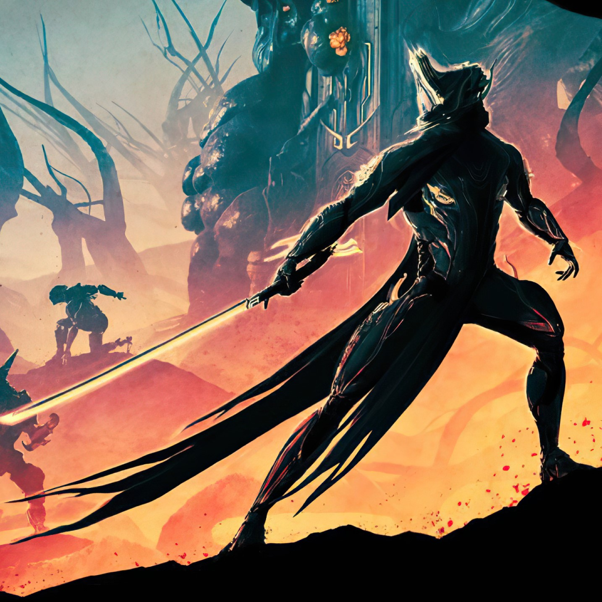

## Hello there !

I'm lyzer, a 20 years old developper curently in second year in **[@Epitech](https://github.com/Epitech).**
I thrive in in low level languages like **C, C++, x86 Assembly** as well as anything related to software developpement ! 😃

I started coding at 11 years old on scratch, and then started self teaching **Python** at 16, I then started C at school, which is now my language of choice.

I work on both academic and personnal projects from time to time, the one I like most from school is **[Wolfenstein3d](https://github.com/lyzer-px/Wolfenstein3d)** 🔫, the released before a certain
**[game](https://www.google.com/search?q=doom+1&rlz=1C1CHZN_frFR1159FR1159&oq=doom+1&gs_lcrp=EgZjaHJvbWUqCggAEAAY4wIYgAQyCggAEAAY4wIYgAQyBwgBEC4YgAQyBwgCEAAYgAQyBwgDEC4YgAQyBwgEEC4YgAQyBwgFEAAYgAQyBwgGEAAYgAQyBwgHEAAYgAQyBwgIEAAYgAQyBwgJEAAYgATSAQg0NjM2ajBqN6gCALACAA&sourceid=chrome&ie=UTF-8)** 
we all know and love to run on everything. 💥
  I also created **[Libmeta](https://github.com/lyzer-px/libmeta-3)** which is my own version of the standard libC, I used it at school and It saved me quite a few times.
### My ambitions
I aspire to create software everyone will use, a solution to one of our modern problems. I am really fond of 🐳 **[Docker](https://www.docker.com/)** and their history   (Did you know they come from my school ?) and I would like to have as much as impact as them on my fellow developper's everyday life.
### Languages I have experience with
* C/C++ (main)
* x86 Assembly
* Python
* Lua
* JavaScript
* Scratch
* Blueprint (Unreal Engine)
### Hobbies
* 🎮 I am a really hardcore gamer, I've played ***[Warframe](https://www.warframe.com)*** for thousands of hours ! After playing so much, I really wanted to understand what is behind the game.
* 🚲 I like cycling, it was an obsession when I was little.
* 🏎️ I am passionate about cars ! Whether it is racing (Watching/piloting), sports cars, JDM, ... I get exited about anything that has an engine.
* 📖/🌍 I enjoy history and geography, it is so interesting to know about the past, I focus on antique history.
* ⚗️ I have strong interest about mathematics, physics, chemestry and biology !
* 💮 Japanese culture is one of my favorite, I like anime, mangas, origamis. I am part of an association about it.

Feel free to browse my public repositories, open pull requests, I am always open to new opportunities !
